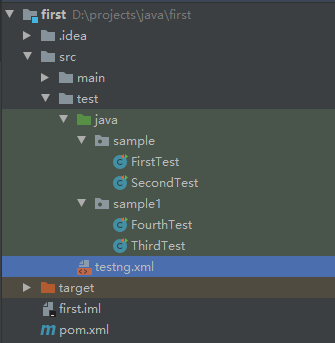
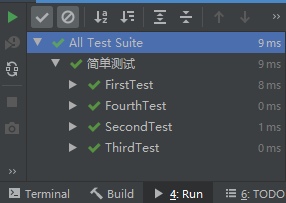
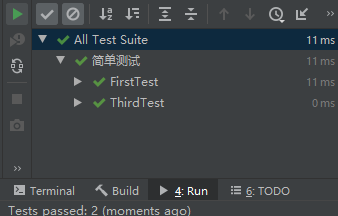
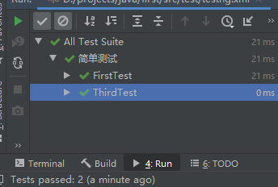
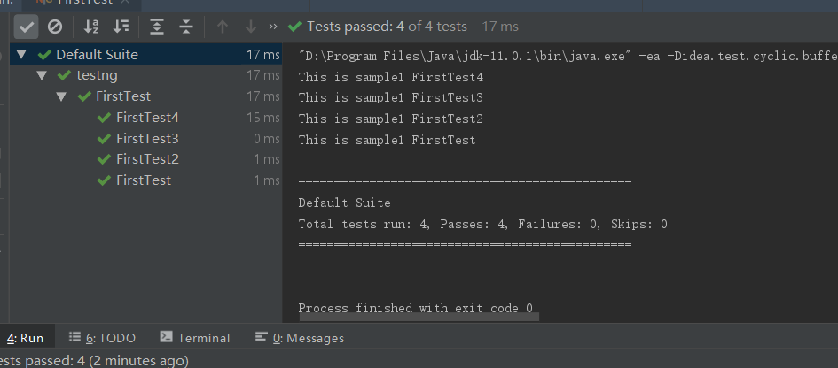
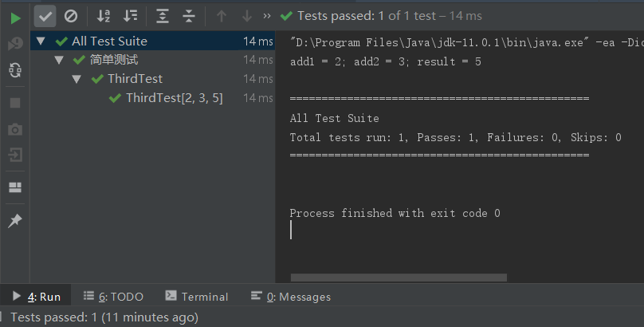
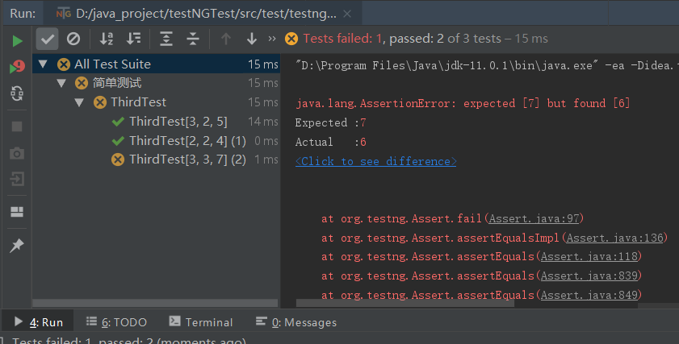

# Testng 简单入门

## 1. Testng 简介

> TestNG是一个Java语言的测试框架，由Cédric Beust受到JUnit和NUnit的启发而创建。TestNG的设计目标是，覆盖更广泛的测试类别范围：单元测试、功能测试、端到端测试、集成测试等，并且功能更强大、更易于使用。 -- Wiki百科

## 2. 安装

在 *IntelliJ IDEA* 中创建 Java 项目，选择 ***Maven*** ，*Maven* 是 **Apache Maven是一个软件项目管理和理解工具。基于项目对象模型（POM）的概念，Maven可以从一个中心信息管理项目的构建，报告和文档** 。创建完成后，在 *pom.xml* 文件中加入如下的内容。

``` xml
<repositories>
        <repository>
            <id>jcenter</id>
            <name>bintray</name>
            <url>http://jcenter.bintray.com</url>
        </repository>
    </repositories>

    <dependencies>
        <dependency>
            <groupId>org.testng</groupId>
            <artifactId>testng</artifactId>
            <version>6.10</version>
            <scope>test</scope>
        </dependency>
    </dependencies>
```

然后在右下角的提示框中点击 *enable* ，开始自动下载 Testng 所需要的依赖。

##　注解

| 注解 | 描述 |
| :---- | :---- |
| @BeforeSuite | 在该套件中的所有测试都运行在注释的方法之前，仅运行一次 |
| @AfterSuite | 在该套件的所有测试都运行在注解之后，仅运行一次。 |
| @BeforeClass | 在调用当前类的第一个测试方法之前运行，注释方法仅运行一次 |
| @AfterClass | 在调用当前类的第一个测试方法之后运行，注释方法仅运行一次 |
| @BeforeTest | 注释的方法将在属于 `<test>` 标签内的类的所有测试方法运行之前运行 |
| @AfterTest | 注释的方法将在属于 `<test>` 标签内的类的所有测试方法之后运行 |
| @BeforeGroups | 配置方法将在之前运行组列表。此方法保证在调用属于这些组中的任何一个的第一个测试方法之前不久运行 |
| @AfterGroups | 此配置方法将在之后运行组列表，该方法保证在调用属于任何这些组的最后一个测试方法之后不久运行 |
| @BeforeMethod | 注释方法将在每个测试方法之前运行 |
| @AfterMethod | 注释方法将在每个测试方法之后运行 |
| @DataProvider | 标记一种方法来提供测试方法的数据。注释方法必须返回一个 `Object[][]` ，其中每个 `Object[]` 可以被分配给测试方法的参数列表。要从该 `DataProvider` 接收数据的 `@Test` 方法需要使用与此注释名称相等的 `dataProvider`名称 |
| @Factory | 将一个方法标记成工厂，返回 `TestNG` 将被用作测试类的对象。该方法必须返回 `Object[]` 。 |
| @Listeners | 定义测试类上的侦听器。 |
| @Parameters | 描述如何将参数传递给 `@Test` 方法。 |
| @Test | 将类或方法标记为测试的一部分。 |

## 3. 关于 ***testng.xml*** 文件的解析

首先在刚创建的时候，找不到这个文件，首先要开始创建这个文件。 在 *IntelliJ IDEA* 中安装 ***Create TestNG XML*** 这个插件，然后右键点击项目名称，找到菜单中的 *Creat TestNG XML* 的选项。点击之后，就会生成一个 *testng.xml* 的文件，具体如下图。


首先， ***testng.xml*** 的文件样式如下面所示。

```xml
<?xml version="1.0" encoding="UTF-8"?>
<!DOCTYPE suite SYSTEM "http://testng.org/testng-1.0.dtd">
<suite name="Suite1" verbose="1" >
  <test name="Nopackage" >
    <classes>
       <class name="NoPackageTest" />
    </classes>
  </test>

  <test name="Regression1">
    <classes>
      <class name="test.sample.ParameterSample"/>
      <class name="test.sample.ParameterTest"/>
    </classes>
  </test>
</suite>
```

+ `<suite>...</suite>` 表示定义了的一个测试套件。

  + `name` 定义测试套件的名称。

  + `verbose` 定义命令行信息打印等级，不会影响测试报告输出内容；可选值(1|2|3|4|5)

+ `<test>...</test>` 表示定义了一个测试。

  + name 定义测试的名称

+ `<classes>...</classes>` 表示定义一组测试类

  + `<class>...</class>` 表示定义一个测试类。

    + `name` 指定要运行的测试类。

## 4. 测试级别设置

创建测试用例时，大概分三个层级。

+ 测试包（目录）

+ 测试类（文件）

+ 测试用例（`@Test` 注解的方法）

### 4.1 指定运行测试包

首先看下项目的结构,我是将在主目录下的 ***testng.xml*** 文件移动到了 *src/test* 的目录下，如下图。



此时的 ***testng.xml*** 文件位于 ***test*** 的文件夹下，内容配置如下所示

``` xml
<?xml version="1.0" encoding="UTF-8"?>
<!DOCTYPE suite SYSTEM "http://testng.org/testng-1.0.dtd">
<suite name="All Test Suite">
    <test verbose="2" preserve-order="true" name="简单测试">
        <packages>
            <package name="sample"></package>
            <package name="sample1"></package>
        </packages>
    </test>
</suite>
```

这样的设定后，右键 ***testng.xml*** 文件，然后点击 `run`，执行效果如下图所示。



会发现两个目录下所有的类都运行完成。具体的一些参数如下。

+ `<packages>...</packages>` 定义一组测试包。

+ `<package.../>` 定义一个测试包。

  + *name* 指定测试包（目录）的名称。

### 4.2 指定运行测试类

项目结构与上一小节 **4.1** 一致，***testng.xml*** 文件内容配置如下所示。

``` xml
<?xml version="1.0" encoding="UTF-8"?>
<!DOCTYPE suite SYSTEM "http://testng.org/testng-1.0.dtd">
<suite name="All Test Suite">
    <test verbose="2" preserve-order="true" name="简单测试">
        <classes>
            <class name="sample.FirstTest"/>
            <class name="sample1.ThirdTest"/>
        </classes>
    </test>
</suite>
```

右键 ***testng.xml*** 文件，然后点击 `run` ，执行结果如下图所示。



会发现在 ***testng.xml*** 配置文件中指定的两个文件夹下的两个类运行，未指定的类并没有运行。

### 4.3 指定运行测试用例

项目结构与 **4.1** 一致，***testng.xml*** 的内容配置如下所示。

``` xml
<?xml version="1.0" encoding="UTF-8"?>
<!DOCTYPE suite SYSTEM "http://testng.org/testng-1.0.dtd">
<suite name="All Test Suite">
    <test verbose="2" preserve-order="true" name="简单测试">
        <classes>
            <class name="sample.FirstTest">
                <methods>
                    <include name="FirstTest"/>
                </methods>
            </class>
            <class name="sample1.ThirdTest">
                <methods>
                    <include name="ThirdTest"/>
                </methods>
            </class>
        </classes>
    </test>
</suite>
```

右键 ***testng.xml*** 文件，然后点击 `run` ，执行结果如下图所示。



会发现指定类中的指定的测试用例执行，其他的并没有执行。具体的参数解析如下。

+ `<methods>...</methods>` 定义一组测试方法。

+ `<include.../>` 指定包含的测试用例（方法）。

  + `name` 指定测试用例（方法）的名称。

***注意：*** 测试方法 `<methods>` 必须包含在 `<class>` 标签中。

## 5. TestNG 用例分组

测试用力的划分

### a. 根据用例的重要程度划分

+ 重要程度： **低 ——> 中——>高**

### b. 根据用例的类型划分

+ 类型： **正常——>异常**

### c. 实例

项目的结构还是用 **4.1** 的项目，如下图。


其中，此次模块只用了 *sample/FirstTest* 这个类，标签有 *高、中、低、正常和异常* ，每个用例有两个标签 ，内容如下。

``` java
package sample1;

import org.testng.annotations.Test;

@Test(groups = {"功能测试"})
public class FirstTest {
    @Test(groups = {"高", "正常"})
    public void FirstTest(){
        System.out.println("This is sample1 FirstTest");
    }

    @Test(groups = {"高", "正常"})
    public void FirstTest2(){
        System.out.println("This is sample1 FirstTest2");
    }

    @Test(groups = {"中", "正常"})
    public void FirstTest3(){
        System.out.println("This is sample1 FirstTest");
    }

    @Test(groups = {"低", "异常"})
    public void FirstTest4(){
        System.out.println("This is sample1 FirstTest2");
    }
}
```

运行标签为 *高* 的用例，  ***testng.xml*** 文件的配置如下。

``` xml
<?xml version="1.0" encoding="UTF-8"?>
<!DOCTYPE suite SYSTEM "http://testng.org/testng-1.0.dtd">
<suite name="All Test Suite">
    <test verbose="2" preserve-order="true" name="简单测试">
        <groups>
            <run>
                <include name="高"/>
            </run>
        </groups>
        <classes>
            <class name="sample1.FirstTest"/>
        </classes>
    </test>
```

右键 ***testng.xml*** 文件，然后点击 `run`，这个配置将运行标签为 *高* 的用例，也就是前两个用例。具体一些参数的解析如下。

+ `<groups>...</groups>` 测试组标签。

+ `<run>...</run>` 运行测试。

+ `<exclude>` 根据 groups 的设置，排除不执行的用例。

+ `<include>` 根据 groups 的设置，指定执行的测试用例。

一开始，我们给 *FirstTest* 也划分了组 （`groups = {"功能测试"}`）,现在修改 ***testng.xml*** 的配置，完整的配置如下。

``` xml
<?xml version="1.0" encoding="UTF-8"?>
<!DOCTYPE suite SYSTEM "http://testng.org/testng-1.0.dtd">
<suite name="All Test Suite">
    <test verbose="2" preserve-order="true" name="简单测试">
        <groups>
            <run>
                <exclude name="异常"/>
                <include name="功能测试"/>
            </run>
        </groups>
        <classes>
            <class name="sample1.FirstTest"/>
        </classes>
    </test>
</suite>
```

执行这个配置，可以使 *FirstTest* 这个标记 `功能测试` 标签的类，除了 有 `异常` 标签的第四个用例外，都将执行。

## 6. TestNG 的执行顺序

一开始，我认为 TestNG 是按照顺序来执行的，结果发现并不是。然后发现要想按照顺序来执行，其实特别简单，有三种方法。

### a. 按照排序

很好理解，就像字典的排序，通过字母的排序来进行的， TestNG 默认的运行方式就是按照排序来的。所以想要特定的顺序来执行的话，只需要在命名上按照顺序来就好了。

### b. 按照优先级

在 `@Test` 的注解中，有一个参数是 `priority` ，也就是优先级，可以给每一个测试用例定义不同的优先级来决定运行的先后顺序。具体的用法如下所示。

``` java
package sample1;

import org.testng.annotations.Test;

@Test(groups = {"功能测试"})
public class FirstTest {
    @Test(groups = {"高", "正常"}, priority = 4)
    public void FirstTest(){
        System.out.println("This is sample1 FirstTest");
    }

    @Test(groups = {"高", "正常"}, priority = 3)
    public void FirstTest2(){
        System.out.println("This is sample1 FirstTest2");
    }

    @Test(groups = {"中", "正常"}, priority = 2)
    public void FirstTest3(){
        System.out.println("This is sample1 FirstTest3");
    }

    @Test(groups = {"低", "异常"}, priority = 1)
    public void FirstTest4(){
        System.out.println("This is sample1 FirstTest4");
    }
}
```

在这个类的文件名上直接右键，然后点击 `Run` ，不需要通过 `testng,xml` 文件来运行。运行的结果如下图所示。



然后就会按照优先级的设置执行，其中数字越小，优先级越高。

### c. 通过 `testng.xml` 文件修改配置

还是用到前边的例子，使用 *FirstTest.java* 这个类。具体的配置如下所示。

``` xml
<?xml version="1.0" encoding="UTF-8"?>
<!DOCTYPE suite SYSTEM "http://testng.org/testng-1.0.dtd">
<suite name="All Test Suite">
    <test verbose="2" preserve-order="true" name="简单测试">
        <classes>
            <class name="sample1.FirstTest">
                <methods>
                    <include name="FirstTest4"/>
                    <include name="FirstTest2"/>
                    <include name="FirstTest3"/>
                    <include name="FirstTest"/>
                </methods>
            </class>
        </classes>
    </test>
</suite>
```

+ `preserve-order` 参数用于控制测试用例的执行顺序。如果为 *true* ，就会按照配置的顺序执行；如果为 *false* ，那么默认会按照用例的名称的有字母/数字的顺序执行。

***注意： 不设置的情况下默认为true***

### d. 总结

三种方法中，执行的优先级顺序是 ***priority优先级 >  testng.xml 配置文件 > 默认字母顺序*** ，因此，设置优先级最好采用一种，以免有所冲突。

## 7. TestNG 用例依赖

### a. 测试方法依赖

当一条用例执行失败时，其它用例必然也会失败，所以，我们就没有必要再运行其它用例了，这个时候我们就可以设置用例之间的依赖。

``` java
package sample1;

import org.testng.Assert;
import org.testng.annotations.Test;

public class SecondTest {
    @Test
    public void SecondTest(){
        Assert.assertEquals(3 + 1 , 5);
    }

    @Test(dependsOnMethods = {"SecondTest"})
    public void SecondTest2(){
        Assert.assertEquals(3 + 2, 5);
    }
}
```

+ `dependsOnMethods` 来设置用例的依赖，当 *SecondTest()* 运行失败时，则 *SecondTest2()* 则将不再被执行。

### b. 测试组依赖

``` java
package sample1;

import org.testng.Assert;
import org.testng.annotations.Test;

public class SecondTest {
    @Test(groups = {"test"})
    public void SecondTest(){
        Assert.assertEquals(3 + 1 , 5);
    }

    @Test(groups = {"test"})
    public void SecondTest2(){
        Assert.assertEquals(3 + 2, 5);
    }

    @Test(dependsOnGroups = {"test"})
    public void SecondTest3(){
        Assert.assertEquals(3 + 2, 5);
    }
}
```

+ `dependsOnGroups`  来设置组的依赖，*SecondTest()* 和 *SecondTest2()* 同属于一个 ***test*** 组，*SecondTest3()* 依赖于 ***test*** 组，该组中有一条用例执行失败，则 *SecondTest3()* 不再执行。

## 8. TestNG 用例参数化

> 参数化也是测试用例中常用的技巧之一，它可以增加用例的可配置性和减少相同用例的编写。

### 8.1 通过 `@Parameters` 实现参数化

项目结构还是和之前的一样，这次使用的是 *simple2/ThirdTest.java* 这个类。具体的代码如下面所示。

``` java
package sample2;

import org.testng.Assert;
import org.testng.annotations.Parameters;
import org.testng.annotations.Test;

public class ThirdTest {
    @Test
    @Parameters({"add1", "add2", "result"})
    public void ThirdTest(int add1, int add2, int result){
        Assert.assertEquals(add1 + add2, result);
        System.out.println("add1 = " + add1 + "; " + "add2 = " + add2 + "; " + "result = " + result);
    }
}
```

然后就是定义 ***testng.xml*** 文件，具体的配置如下所示。

``` xml
<?xml version="1.0" encoding="UTF-8"?>
<!DOCTYPE suite SYSTEM "http://testng.org/testng-1.0.dtd">
<suite name="All Test Suite">
    <test verbose="2" preserve-order="true" name="简单测试">
        <parameter name="add1" value="2"/>
        <parameter name="add2" value="3"/>
        <parameter name="result" value="5"/>
        <classes>
            <class name="sample2.ThirdTest"></class>
        </classes>
    </test>
</suite>
```

具体的参数解析如下。

+ `<parameter.../>` 定义测试数据

  + `name` 定义数据的名字，在测试用例中通过该名字来获取对应的  `value` 。

  + `value` 定义测试数据，通过对应的 `name` 来获取该值。

运行 `testng.xml` 的结果如下图所示。



会发现运行的结果参数就是我们在 *testng.xml* 中设置的值。

### 通过 `@DataProvider` 实现参数化

本次实例使用 *simple2/ThirdTest.java* 这个类，然后 `@DataProvider` 的使用方法如下面代码所示。

``` java
package sample2;

import org.testng.Assert;
import org.testng.annotations.DataProvider;
import org.testng.annotations.Test;

public class ThirdTest {

    // 定义对象数组
    @DataProvider(name = "add")
    public Object[][] user(){
        return new Object[][]{
                {3, 2, 5},
                {2, 2, 4},
                {3, 3, 7}
        };
    }

    @Test(dataProvider = "add")
    public void ThirdTest(int add1, int add2, int result){
        Assert.assertEquals(add1 + add2, result);
    }
}
```

其中的某些参数解析如下：

+ `@DataProvider` 定义对象数组，数组名称为 *add*。

在 *ThirdTest()* 中通过 `dataProvider="add"` 来调用定义的对象数组，并通过参数获取相应的测试数据。

直接在 *ThirdTest* 类上右击，点击 `Run` ，运行此类，不需要在 *testng.xml* 文件中配置。执行结果如下图所示。



会发现，定义的数组中的所有的参数都被执行。
