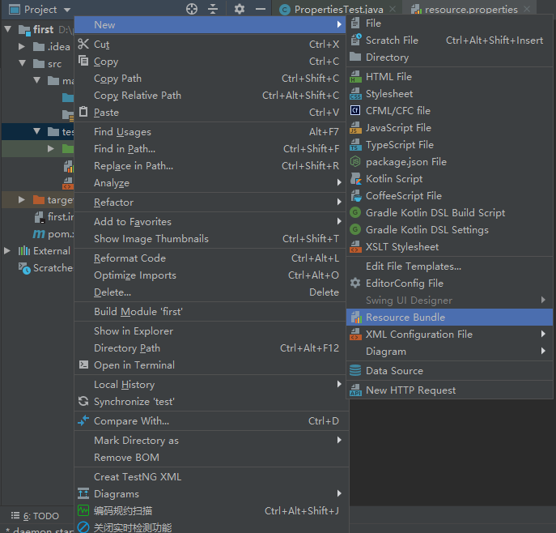

# Java 读取配置文件

> Java 开发中，需要将一些易变的配置参数放置在 *XML* 配置文件或者 *properties* 配置文件中。然而 *XML* 配置文件需要通过 *DOM* 或 *SAX* 方式解析，然而读取 *properties* 文件就比较容易。

## 1. Java 读取 *.properties* 的配置文件

### 1.1 创建 *.properties* 配置文件

首先在你想要创建配置文件的目录上 *右键->New->Resource Bundle* ,具体如下图。

