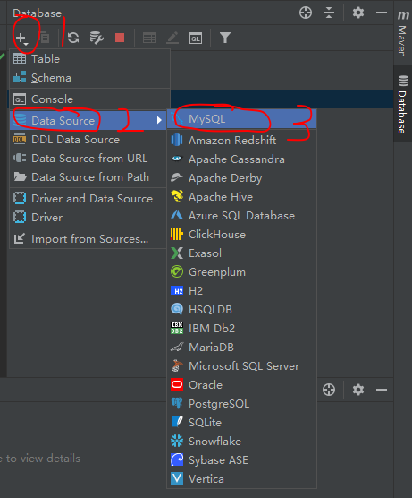

# Mysql 基础

> 前言：本来打算先写 TestNG 框架的，写着写着发现需要连接数据库了，然后又开始读取配置文件了，最后现在先写写 Mysql 的使用。

## 1. 安装（Windows）

``` text
这里只作 Windows 的安装介绍， Linux 平台有点多，安装现在也比 Windows 麻烦点，这里只是练习 Mysql 语句，所以就不介绍了，如果需要的话，我可以另作介绍。
```

### 1.1 下载

首先登陆 [Mysql 的中文官网](https://www.mysql.com/cn/) ，或者直接登录 [可执行文件下载页面](https://dev.mysql.com/downloads/windows/installer/8.0.html) ，我们这里选择 *Community* 版本的，因为是免费的。专业版或者说是企业版的，对于我们来说没有必要，毕竟只需要简单的使用即可，破解方法应该也会有，但是太耗时，得不偿失。或者直接点击 [下载链接](https://dev.mysql.com/get/Downloads/MySQLInstaller/mysql-installer-community-8.0.17.0.msi) ，即可下载。

下载页面如下图所示。


### 1.2 安装

下载完成后，只需要双击 `.msi` 文件即可。然后就是按照步骤一步步的安装、配置。其中要记住的是你设置的数据库的用户名、密码和数据库名。这是接下来连接数据库所必备的。

## 1.3 启动 Mysql

需要以管理员的权限启动 *CMD*，直接在 *Windows* 搜索框输入 *cmd* ，然后再搜索的结果上右键，选择 *以管理员权限运行* ，具体如下图所示。


然后在弹出的窗口中输入 `net start mysql` ,等待 *success* 的回复，即可。

然后就是连接数据库了，工具有很多，我用的是 **JetBrains** 公司的 ***DataGrip*** ，不得不承认 **JetBrains** 公司的 *IDE* 是真的好用，顺便推荐下 Java 的 *IDE* ***IntelliJ IDEA*** ，这款 *IDE*　被称为地表最强的 Java 编译器。然后因为电脑性能的问题，我就直接在 ***IntelliJ IDEA*** 中连接数据库。

首先点击新建的按钮，然后点击 *Data Source* ，最后选择 *MySQL*，然后就是在弹框中填写相关的信息。具体步骤如下图。



在弹出的界面中填写在新建数据库时填写的信息，创建连接，填写信息界面如下图。


填写完信息后，就要测试是否能正常连接，然后点击 `Test Connection` 按钮，如果出现问题，就会出现如下界面。


这个问题从网上查询，是因为数据库和系统时区的差异造成的问题，只需要在 *URL* 的选框的最后添加 `?serverTimezone=GMT%2B8` ，再次测试即可成功测试通过。如下图。


这样的话就说明你的数据库、连接配置等是正常的，只需要点击下方的 ***OK*** 即可。然后成功连接的图如下图所示。


然后就是简单的使用了，首先就是打开命令终端。首先是点击 终端按钮，然后选择 *console(Default)* ，亦或者 *New Console* ，然后就是出现命令行的界面。具体如下图。


然后就可以在终端上使用 Mysql 的命令了。
